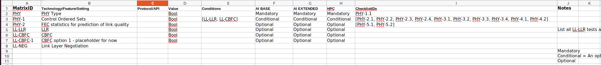
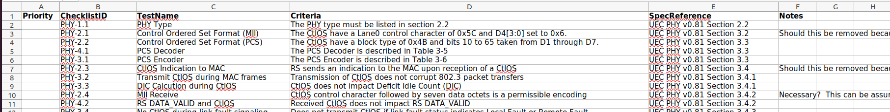

<h1>Contents</h1>

- [Compliance test checklists and profiles](#compliance-test-checklists-and-profiles)
- [Organization and Workflows](#organization-and-workflows)
  - [File Organization](#file-organization)
  - [Development Workflows](#development-workflows)
  - [Release and Publishing Workflows](#release-and-publishing-workflows)
- [Schema Specification](#schema-specification)
  - [Common Specifications](#common-specifications)
    - [List format](#list-format)
- [Profile Table format](#profile-table-format)
  - [Visual Example:](#visual-example)
  - [.csv example:](#csv-example)
  - [Column Specifications](#column-specifications)
    - [MatrixID](#matrixid)
    - [Technology/Feature/Setting](#technologyfeaturesetting)
    - [Protocol/API](#protocolapi)
    - [Value](#value)
    - [Conditions](#conditions)
    - [AI BASE](#ai-base)
    - [AI Extended](#ai-extended)
    - [HPC](#hpc)
    - [Notes](#notes)
    - [ChecklistIDs](#checklistids)
- [Checklist Table format](#checklist-table-format)
  - [Visual Example:](#visual-example-1)
  - [.csv example:](#csv-example-1)
  - [Column Specifications](#column-specifications-1)
    - [Priority](#priority)
    - [ChecklistID](#checklistid)
    - [TestName](#testname)
    - [Criteria](#criteria)
    - [SpecReference](#specreference)
    - [Notes](#notes-1)

# Compliance test checklists and profiles
This directory contains subdirectories for each of the different layers or domains to be tested. Each directory contains "profiles" and "checklists": concise, tabular data which describe a feature matrix and test cases.

* Profiles are well-specified collections of features or capabilities. The features are organized as a "Matrix." Hypothetical features or capabilities would be "basic" or "advanced." Each such feature or capability has a corresponding list of checklist "IDs" which constitute a set of test cases which must be validated.
* Checklists are lists of individual test-cases to be run, along with descriptive data, conditions, etc., and are referenced by the profiles described above.
  
# Organization and Workflows
The organization and workflows of the checklist files are depicted in the diagram below.


## File Organization
* Checklist data are stored as files in the [uec-compliance github repository](https://github.com/ultraethernet/uec-compliance) under the top-level `checklists/` directory
* Each layer or domain stores checklist files in a dedicated subdirectory. Other supporting material can be located in these directories as well.
* Files conform to the [Schema Specification](#schema-specification) described below.
* A separate `schema-tool/` directory contains tools to read, validate and query the checklist files

## Development Workflows
* All files are stored in Github.
* Branches can be created to work on new versions.
* Pull Requests are submitted to merge changes into the main branch
* Git CI Actions will be used to run automated validation checks on all schema commits and pull requests. Invalid schema will not be accepted.

## Release and Publishing Workflows
* At suitable intervals, the entire repo can be tagged and released as a snapshot. These comprise stable, well-defined configurations of the entirety of the repo.
* Released versions of all checklist files and the schema-tool can be bundled (e.g. as a .zip file) and published to the Causeway site for public access and distribution.
* Bundles of the checklist files and schema tool *might* be released with the same tags/versions as the overall UET set of specs; or bundles may follow their own bundle version numbering since a given bundle may contain different versions of consituent UEC specs and checklists. In either case, a bundle will be tightly version-controlled and all components will be versioned and traceable.

# Schema Specification

## Common Specifications

>**TODO** Should we define a schema version (semantic version string e.g. 1.2.3) which is in the file somewhere and can be read to perform migration/conversion/compatibility functions?
<br><br>**Idea**: Define a new first column labeled "metadata". Cells below can contain propery key:value pairs, e.g. "semver:1.2.3" These don't relate to the other columns at all, it's just a convenient place to store stuff. We could pack multiple properties per row, one per row, or both. Cna add more as needed.

>**TODO** Does every layer use same format?


* Two interdependent tables: "profile" and "checklist"
* Alternative file formats:
  *.csv (comma-separated value), **recommended**: one file for checklist and one for format
  *.xlsx (Excel) - one file with two "sheets:" profile and checklist
* Tablular 2D data, although some table cells can contain specially formatted "lists"
* Headers and other table structure follow precise specifications
* No empty "spacer" columns or stray content, i.e. random comments not adhering to columnar data. A "Notes" or "Comment" column should be used, which can be ignored by programs which read this data.
* Certain cells may contain [lists](#list-format) where indicated

### List format
List entries in a single table cell are formatted as comma-separated values inside square brackets, for example:
  ```
  [PHY-2.1, PHY-2.2, PHY-2.3, PHY-2.4, PHY-3.1, PHY-3.2, PHY-3.3, PHY-3.4, PHY-4.1, PHY-4.2]
  ```

# Profile Table format

## Visual Example:

## .csv example:

```
MatrixID,Technology/Feature/Setting,Protocol/API,Value,Conditions,AI BASE,AI EXTENDED,HPC,ChecklistIDs
PHY,PHY Type,,Bool,,Mandatory,Mandatory,Mandatory,PHY-1.1
PHY-1,Control Ordered Sets ,,Bool,"[LL-LLR, LL-CBFC]",Conditional,Conditional,Conditional,"[PHY-2.1, PHY-2.2, PHY-2.3, PHY-2.4, PHY-3.1, PHY-3.2, PHY-3.3, PHY-3.4, PHY-4.1, PHY-4.2]"
PHY-2,FEC statistics for prediction of link quality,,Bool,,Optional,Optional,Optional,"[PHY-5.1, PHY-5.2]"
LL-LLR,LLR,,Bool,,Optional,Optional,Optional,List all LL-LLR tests and PHY tests associated with PHY-1?
LL-CBFC,CBFC,,Bool,,Optional,Optional,Optional,
LL-CBFC-1,CBFC option 1 - placeholder for now,,Bool,,Optional,Optional,Optional,
LL-NEG,Link Layer Negotiation,,,,,,,
```

## Column Specifications
>**TODO** How to accomodate future profiles; do we insert columns to the left of `ChecklistIDs`?

>**TODO** Fully define each column.


### MatrixID
### Technology/Feature/Setting
### Protocol/API
### Value
### Conditions
### AI BASE
### AI Extended
### HPC
### Notes
Arbitrary text, ignored by all tools.
### ChecklistIDs
A [lists](#list-format) of checklist IDs this matrix ID must be validated against.All IDs must appear in the corrsponding "Checklist" table.

# Checklist Table format

## Visual Example:

## .csv example:

```
Priority,ChecklistID,TestName,Criteria,SpecReference,Notes
,PHY-1.1,PHY Type,The PHY type must be listed in section 2.2,UEC PHY v0.81 Section 2.2,
,PHY-2.1,Control Ordered Set Format (MII),The CtlOS have a Lane0 control character of 0x5C and D4[3:0] set to 0x6.,UEC PHY v0.81 Section 3.2,Should this be removed because it isn't a testable interface?
,PHY-2.2,Control Ordered Set Format (PCS),The CtlOS have a block type of 0x4B and bits 10 to 65 taken from D1 through D7.,UEC PHY v0.81 Section 3.3,
,PHY-4.1,PCS Decoder,The PCS Decoder is described in Table 3-5,UEC PHY v0.81 Section 3.3,
,PHY-3.1,PCS Encoder,The PCS Encoder is described in Table 3-6,UEC PHY v0.81 Section 3.3,
,PHY-2.3,CtlOS Indication to MAC,RS sends an indication to the MAC upon reception of a CtlOS,UEC PHY v0.81 Section 3.4,Should this be removed because it isn't a testable interface?
```

## Column Specifications

>**TODO** Fully define each column.

### Priority
### ChecklistID
### TestName
### Criteria
### SpecReference
### Notes
Arbitrary text, ignored by all tools.
